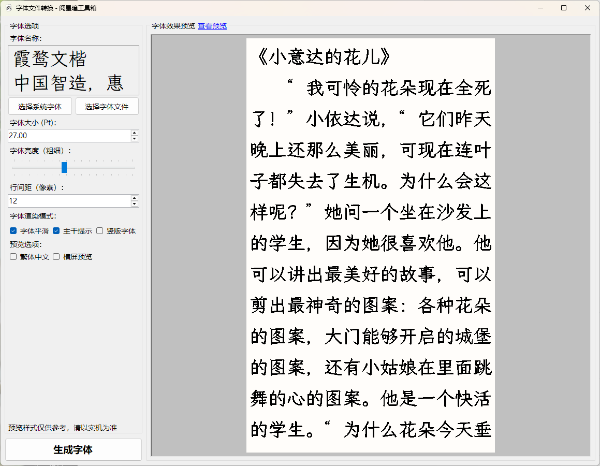

# 阅星曈电纸书相关C#代码库

> 本项目 Fork 自 [ZTYFDroid/xteink-toolkit](https://gitee.com/ZYFDroid/xteink-toolkit)  
> 原作者：ZTYFDroid
>
一些倒腾阅星曈电子书时编写的代码，目前有以下功能：

## XTEinkFontBinary.cs

读取或修改bin格式的字体文件

使用例见Playground项目

## XTEinkToolkit.csproj

字体制作工具

新增支持了X3和X4比例，分辨率预览切换。

---
